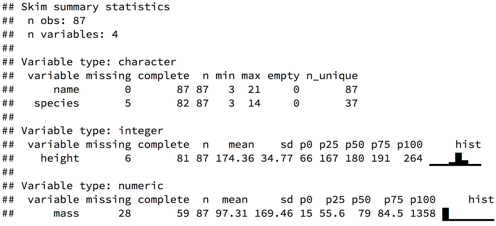
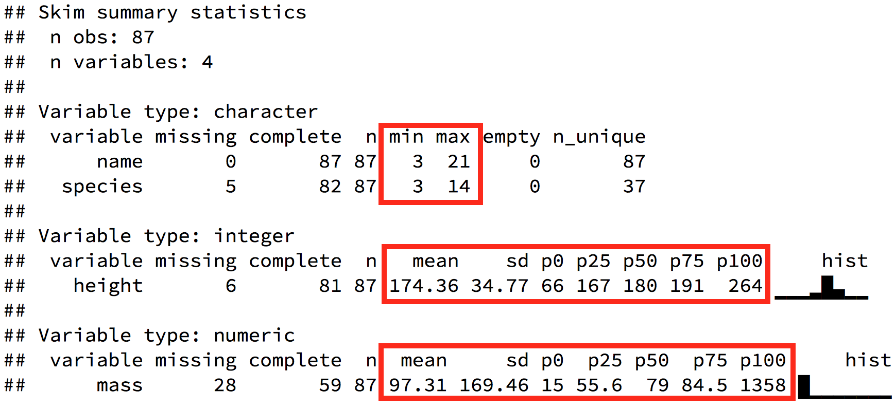

```{r setup, include=FALSE}
options(htmltools.dir.version = FALSE)
knitr::opts_chunk$set(echo = FALSE, message = FALSE, fig.align = 'center')
library(tidyverse)
ggplot2::theme_set(theme_gray(base_size = 18))
```

class: inverse, center, middle

# What is statistics

---

## Questions that statistics asks

- How your data looks like, what shape it has, and what are the parameter values describing your distribution (mean, median, variation, covariation)

- What should we believe, based on our sample, about the real parameter value in the whole population? For example, when in our sample mean height is 178 cm, then what is the probability that real mean height of the population is > 185 cm?

- Does the structure of our statistical model support our scientific hypothesis? For example, when covariance of weight and height can be described by linear regression model, then we can prefer scientific hypothesis that provides mechanism for such relationship

- What and how well our model predicts the future? For example, can our model reasonably well predict outcome using unseen data?

???

- For example, covariation of measured weight and height can be measured with help of correlation coeficient.

---

## Statistics answers scientific questions indirectly

- Main function of statistics is to quantitate the uncertainty when we seek answers to above questions (p-values, posterior distribution of effect size)

- Statistics never answers scientific questions or questions about the state of real world directly, it's more like what is the probability of data given that null hypothesis is true

- Answers that statistics provides remain always confined to our data and models, this puts emphasis on representative sampling

- Therefore one should always prefer well collected, rich data and flexible models in order to keep divergency between model coeficients and real world as small as possible (better data means better models)

- Statistical inferences are always uncertain

---

## Branches of statistics

Statistics can be divided into three broad categories: descriptive, exploratory, and inferential:

1. Descriptive statistics includes summary statistics that are used to summarise a set of observations, in order to communicate the largest amount of information as simply as possible 

1. Exploratory stats creates new hypotheses based on your data and uses iterative visualisation and modeling 

1. Inferential stats consists formal framework to test proposed hypotheses

---
class: inverse, center, middle

# Descriptive stats

---

## Summary stats characterise your sample

- Typical observation of the sample (mean, median, mode)

- Variance of observations (standard deviation, MAD),

- Covariance of variables (correlation coeficient)

```{r, fig.height=4}
set.seed(506)
mode <-  function(x, adjust = 1) {
  x <- na.omit(x)
  dx <- density(x, adjust = adjust)
  dx$x[which.max(dx$y)]
}
d <- data_frame(values = rlnorm(1000, sdlog = 0.6))
ggplot(data = d) +
  geom_density(mapping = aes(x = values, y = ..density..)) +
  geom_vline(xintercept = median(d$values), linetype = "dashed", size = 1) +
  geom_vline(xintercept = mean(d$values), size = 1) +
  geom_vline(xintercept = mode(d$values), linetype = "dotted", size = 1) +
  labs(caption = "MEAN (solid line),\nMEDIAN (dashed line),\nMODE (dotted line) of an log-normal distribution.")
```

Which of these summary statistics represents best your intuition about central tendency of this distribution?

???

- Kui valim on normaaljaotusega (histogramm on sümmeetriline), hinda tüüpilist liiget läbi aritmeetilise keskmise (mean).

Muidu kasuta mediaani (median). Kui valim on liiga väike, et jaotust hinnata (aga > 4), eelista mediaani. Mediaani saamiseks järjestatakse mõõdetud väärtused suuruse järgi ja võetakse selle rea keskmine liige. Mediaan on vähem tundlik ekstreemsete väärtuste (outlierite) suhtes kui mean.

Valimi kõige levinumat esindajat iseloomustab mood ehk jaotuse tipp. Seda on aga raskem täpselt määrata ja mitmetipulisel jaotusel on mitu moodi. Töötamisel posterioorsete jaotustega on mood sageli parim lahendus.

---

## Skim your dataset

Let's have a look at the summary stats of some variables of Starwars movie characters from `tidyverse::starwars` data:
```{r}

```
 
---

## Skim your dataset

Let's have a look at the summary stats of some variables of Starwars movie characters from `tidyverse::starwars` data:
```{r}

```
 
---

## Variance of random variables

- Arithmetic mean is accompanied with standard deviation (SD). SD has same dimension as your data and mean. 

- Preferred format for displaying mean and SD in text is: "**mean (SD)**" (not "mean ( $\pm$ SD)") 

- 1 SD covers 68% normal distribution, 2 SD -- 96% and 3 SD -- 99%. Normal distribution has "thin" tails and for example only 1 out of 1 million data points is 5 SD away from mean 

---

## Example: human IQ

- Human IQ is normally distributed with mean = 100 and sd = 15. 
- When your IQ is 115 (mean IQ of students admitting university is 1 SD away from population mean), then the probability that random person you encounter on the street has higher IQ than you is 16% ((100% - 68%) / 2 = 16%).


```{r, fig.height = 5}
iq <- data_frame(IQ = rnorm(1000, 100, 15))
iqd <- density(iq$IQ)
smarter_than_you <- data_frame(x = iqd$x, y = iqd$y) %>% 
  filter(x >= 115)
ggplot(data = iq) +
  geom_density(mapping = aes(x = IQ)) +
  geom_vline(xintercept = 115, linetype = "dashed", size = 1) +
  geom_ribbon(data = smarter_than_you, mapping = aes(x = x, ymax = y), ymin = 0, alpha = 0.5) +
  labs(title = "Normal distribution\nwith mean=100 and sd=15")
```


---

## When your distribution is not that "normal"

- When your real life distribution has long or "fat" tails or has outliers then formula for calculating SD for normal distribution $s = \sqrt{\frac{\sum_{i=1}^N (x_i- \bar x)^2} {N - 1}}$ will overestimate SD and sample variance  

- When your data can only have positive values, then SD > mean / 2 suggests that your data is not compatible with the normal model 

- Simplest way to fix this situation when you ave only positive values in your dataset is **log transformation**

```{r, fig.height=3.5}
d <- data_frame(`log-normal` = rlnorm(1000)) %>% 
  mutate(`log-transformed` = log(`log-normal`)) %>% 
  gather()
ggplot(data = d) +
  geom_histogram(mapping = aes(x = value)) +
  facet_wrap(~key, scales = "free_x")
```


???

- normal model predicts negative values with relatively high frequency
- igale jaotusele, mida me oskame integreerida, saab ka integraali abil õige katvusega standardhälbe arvutada. 
- Seega tasub meeles pidada, et tavapärane viis standardhälbe arvutamiseks sd() abil kehtib normaaljaotuse mudeli piirides ja ei kusagil mujal! 
- Siiski, kui arvutada standardhälbe sd()-ga, võib olla kindel, jaotusest sõltumata hõlvavad 2 SD-d vähemalt 75% andmejaotusest. 
- Kui andmed ei sobi normaaljaotusesse ja te ei ole rahul tulemusega, mille tõlgendus on nii ebakindel kui 75 protsenti kuni 96+ protsenti, võib pakkuda kahte alternatiivset lahendust:

---

## Mean and SD from log transformed data

- Calculate mean and SD using log-transformed data and then convert them back to linear scale with anti-log (for example, when $log_2(10) = 3.32$, then anti-log is $2^{3.32} = 10$). 

- In this case, geometric mean and multiplicative SD is presented in the original scale:
    - multiplicative SD = geometric mean x SD; geometric mean / SD

- Geometric mean is alway smaller than arthmetic mean 

- SD interval is now assymetric and SD is always > 0

- This procedure ensures that ~68% of log normal data will remain in 1 SD range and 96% data will remain into 2 SD range

---

```{r, echo=TRUE}
# calculate mean and sd using log-trans data
dsum <- filter(d, key == "log-transformed") %>% 
  summarise_at("value", c("mean", "sd"))
# convert calculated mean and sd back to original scale using exp
(bounds <- transmute_at(dsum, c("mean", "sd"), exp) %>% 
  transmute(lower_1 = mean / sd, upper_1 = mean * sd,
            lower_2 = mean / (2 * sd), upper_2 = mean * (2 * sd)))
# test calculated sd boundaries on the original data
filter(d, key == "log-normal") %>% 
  group_by(key) %>% 
  summarise(fraction_data_1SD = sum(value > bounds$lower_1 & value < bounds$upper_1) / 1000,
            fraction_data_2SD = sum(value > bounds$lower_2 & value < bounds$upper_2) / 1000)
```

.footnote[Code can be found at ]
